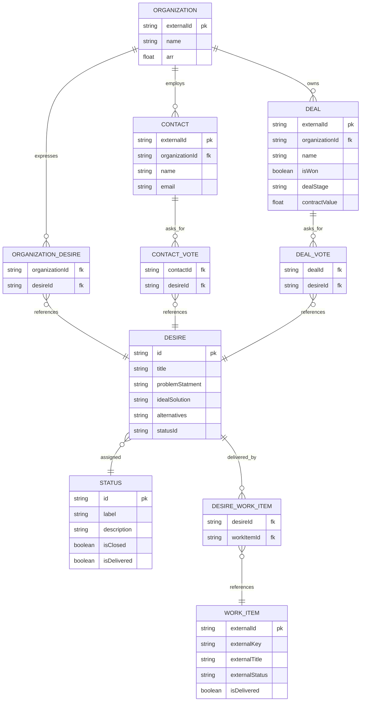

# Product Focus - Requirement Doc

Product Focus ("Procus") is an online application that helps product teams prioritize their backlog by aggregating customer feedback via connection from CRM tool like Hubspot.

## Main Concepts

The application will correlate customer accounts with our internal product backlog through an intermediate object dubbed a 'Desire.'  The application will need to maintain these objects, manage user access, and run regular syncs jobs with the ultimate goal to generate easily consumable reports for our product teams and customer facing roles. 

### Application Owned Objects 

The application will maintain a few objects that are exclusive to the control of our application, managed directly via our UI and or API.

- Desire: Desires represent the individual unit of a customer ask. A desire might be a feature, a fix, minor UI change or comprehensive change in product approach.
- User: Users are the internal members of our company, consisting of customer facing and itnernal roles. Users will have access to create and report on Desires, and can also associate Desires which Organizations, Contacts, and Work Items.
- Report: Reports aggregate and summarize information for multiple audiences, and will consistent of different types support product team and customer facing roles.

### Externally Linked Objects

The application will also maintain awareness of some linked objects where the source of truth is pulled or synced from an external system. Our application will maintain a primary ID for each that will be used to sync the relevant summary fields of interest. But all edits will be made to the upstream system.

- Organization: Organizations represent the legal entity that holds or prospectively holds a contract with our platform. They are associated with a `Company` in the CRM as a 1:1 relationship. ORganizations represent legal entity holding existing or potential contracts. An existing company will have an ARR value of recurring revenue paid to our company.
- Deal: Deals represent individual opportunities to win or expand contracts with organizations. Deals will have a contract value representing potential ARR paid to the company.
- Contact: Contracts are indivudal users or prospepctive users of our platorm. They may express and vote for desires, but do not represent any contract value themselves. These from from the configured CRM like Hubspot
- Work Item: Work Items are the tickets used by product and engineering team to track work. These work items exist outside this applicaiton typically in GitHub Issues or Jira Work. A single Desire has a 0-many relationship with Work Items.

## Integrations

### CRM

The system must connect to an external Customer Relationship Management tool. The first required integration will be Hubspot CRM.

https://developers.hubspot.com/docs/api-reference/overview 

### Work Item Management

The system must connect to an external work item management tool. The first required integration will be GitHub.

- https://docs.github.com/en/rest/projects/projects?apiVersion=2022-11-28
- https://docs.github.com/en/rest/issues?apiVersion=2022-11-28

## Role Based Access Control

The application uses a reasonable RBAC model that controls who can View, Create, Update, and Delete objects within the platform.  Roles may be defined to have different levels of access across the main concepts outlined above.
For instance, an Admin role might have full access across all objects, while a contributor role might have read access to reports, but can create and associate Desires.

### Assignable Desire Permissions 
- Create
- Update
- Delete
- Associate with Organization
- Associate with Contact
- Associate with Work Item

### Assignable Organization Permissions

Since organizations are synced from the CRM, minimal management should occur in the application.

- List Organizations
- View Organization Details & Desires

### Assignable Contact Permissions

Since contacts are synced from the CRM, minimal management should occur in the application.

- List Contacts
- View Contact Details & Desires
  
### Assignable Work Item Permissions

Since work items are merely links to an outside planning tool, minimal management should occur in the application.

- List Linked Work Items
- View Work Item Associated Desires

### Assignable Role Permissions

- Create Roles
- Assign User to Roles
- Assign default Role for new users
- Delete Roles
  
### Assignable User Permissions

- Invite Users
- Edit Users
- Delete Users

### Assignable Report Permissions

- View Reports
  
  
## Object Model (ERD)

This sections defines the Entity Relationship Model including key fields and object relationships.

